這次的旅程由高中的競程同伴發起。基本上我還是偏向處於被帶著走的狀況。老實說我覺得我真的不太會旅遊，其原因在於單看行程本身我是沒有什麼動力的。所以如果讓我安排的話有困難，沒有真的很想要去的地方。或許有空應該要訊問一下行程安排者的心路歷程，以及他們如何看待他們選的這些場所、景點、與餐食。

不過後來發現我們的行程是動態安排的，所以除了第一天我也多少有些參與，算是學到一些新東西。

## 1/15

這次我們對自己相當好，選擇下午的班機。不過我仍是早上 7 點起床。洗衣服，收拾行李，接著就差不多是時候了。跟上次出國不同的是，我們從北車搭機捷過去而非北門。

班機延誤，因此下午抵達後，我們先去 Lawson 買麵包。裡面的店員都是印度人相當神奇，而且他們的日文都很流利。唯一的槽點大概是商品的實際價格標在底下小小的，只能說果然欺瞞顧客是世界共同語言。

接著我們從關西機場坐上 JR west Express 通往京都。沿途上幾乎每個站點都有中文，相當神奇。不僅如此，他也是我目前搭乘過最穩定的電車。抵達時已經是當地晚上 10 點。

我們住在二条 (Nijo)。房間感覺相當好，跟上次去韓國一樣有洗衣機跟電磁爐。白色的床，木製的衣架，與電視上介紹分娩過程在不同時代的差異，共同形成房間裡的畫面。裡面有暖氣，可以調節溫度的熱水，很開心。

## 1/16

早上先去二条城 (Nijo-jo)，我們繞了城外的 3.5 條邊。路上還有看到日本的駕訓班，他們用的車跟我們比起來好上許多，不外觀看起來超新而且還是 Mazda。這裡曾經是幕府將軍的住所。這裡可以看到一間房子裡面有分成不同的院，每個院還有一之間、二之間等等，用來區分階級。此外，我還有看到許多用植物命名的。

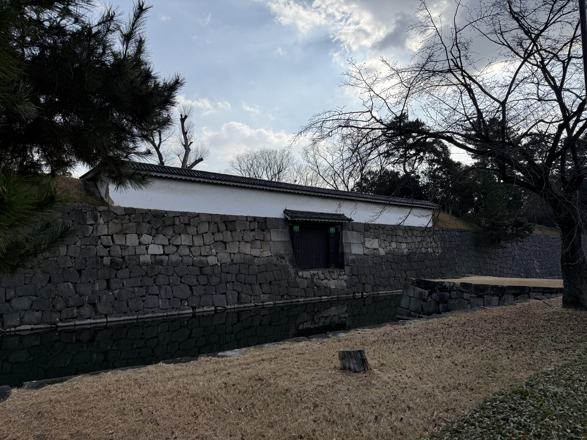

京都御苑以及京都御所曾經是天皇住所。這裡最有印象的是超大的道路以及碎石頭路對腳底造成的傷害，感覺應該需要像是木屐那種硬底的鞋子會比較好。

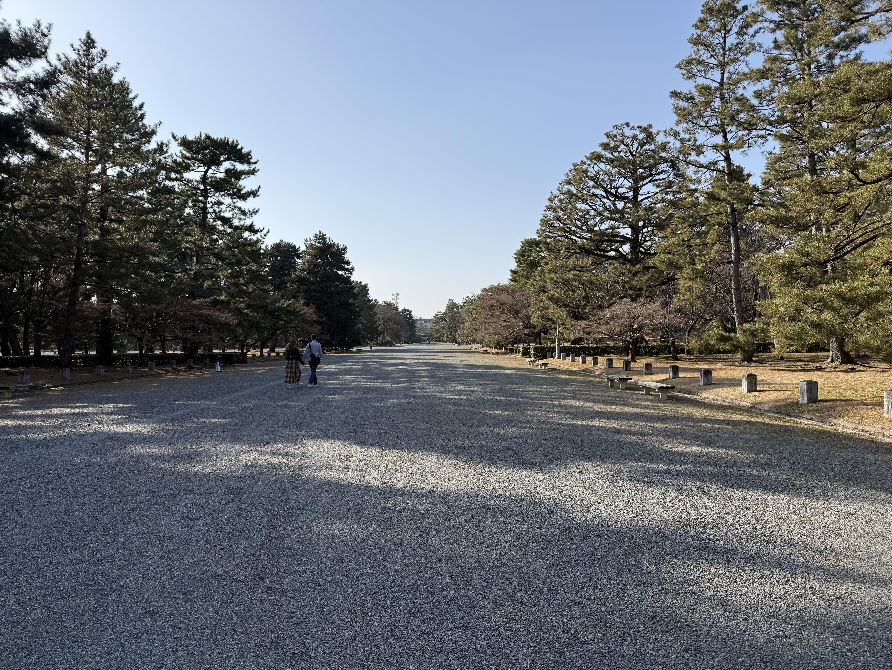

## 1/17

金閣寺的金色外觀確實耀眼，不過人也是一樣的多，所謂的觀光景點大抵如此。拍個照，看一看，感覺到此一遊的氛圍就差不多了。

清水寺在山上，要爬一段路。舞台那邊的視角不錯，可以俯瞰下面的城市。不過最有趣的可能是那些賣東西的小攤販，以及充滿各國語言的人潮。

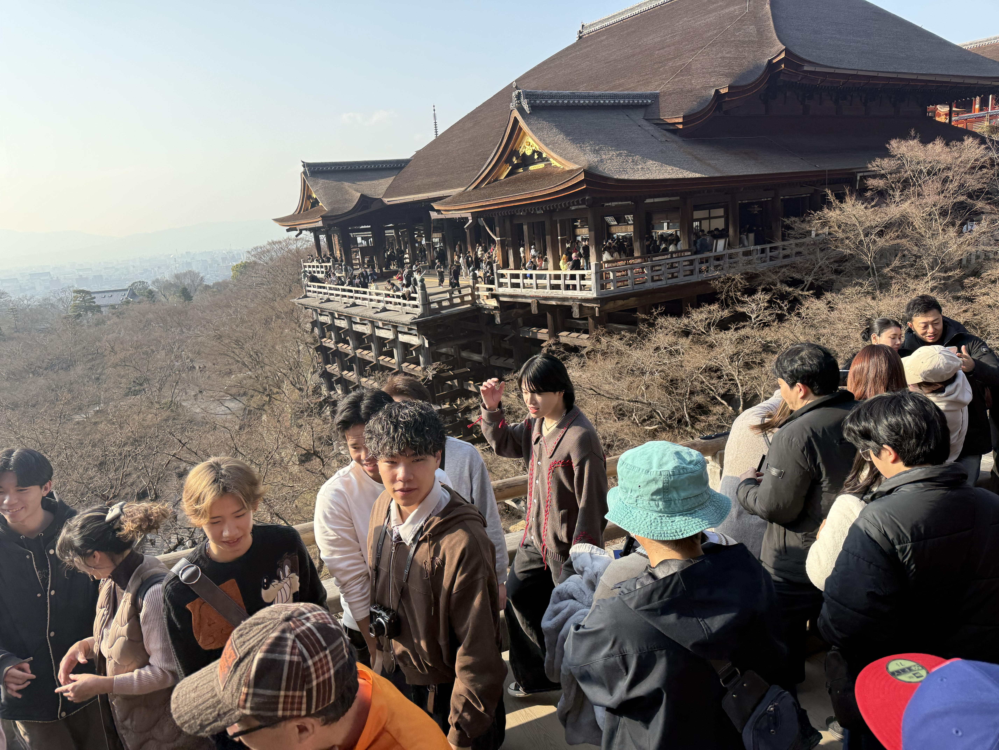

歌舞伎是我這次覺得很特別的體驗。進去之後大概不到二十分鐘就開始想睡，我猜可能真的是室內的 CO2 濃度高導致的嗜睡感，當然劇情和語言完全不通也是一部份。樂器的部分倒是有點意思，三味線的聲音還有太鼓的節奏感，跟我想像中的傳統日本音樂有些落差，比較像是讓你保持緊張感的配樂，而不是悠揚的那種。

晚餐吃大阪燒跟炒麵。比起之前吃到的某間以及日本便利商店的微波大阪燒好很多 ~~當然~~。

## 1/18

奈良的鹿有名，但真的親眼見到才知道有多猛。他們完全不怕人，甚至會主動衝過來。因為大家都有在餵鹿餅，他們只要看到有人手心朝上都會過來聞一下，一個不小心就會被頂，力道也不輕。有點像是披著可愛外皮的流氓。

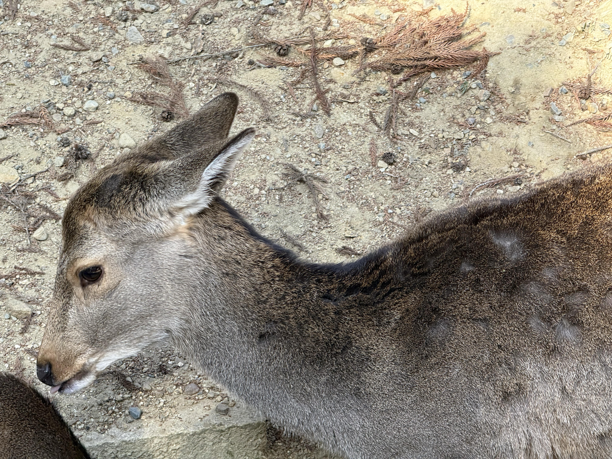

大阪整體感覺比京都熱鬧很多，街道也更雜亂一點，但多了一些生活感。這天大概是整趟旅程吃得最普通的一天，缺乏好吃的食物了 QQ。不過車站很好看。

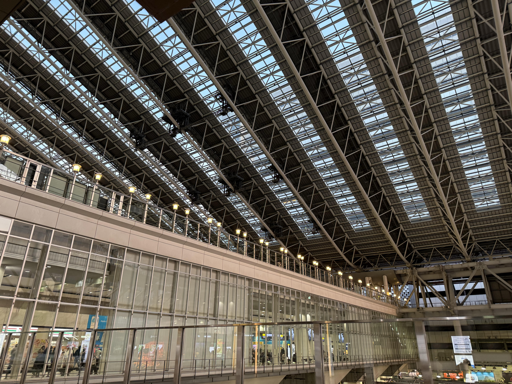

## 1/19

姬路城很壯觀，從外面看就覺得規模很大。爬上去之後才發現裡面的樓梯相當陡，每一層都要注意頭頂。白色的城牆在晴天下看起來確實漂亮，配上周圍的城下町，算是這趟行程裡古蹟類裡面最有完整感的一個。

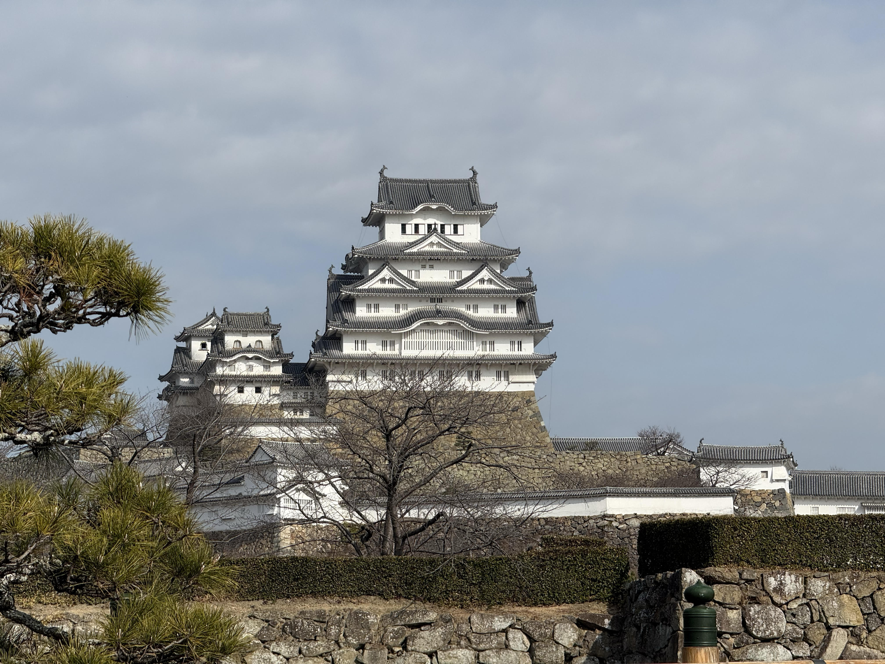

上面看下去不免讓人聯想到古代戰爭。雖然人山人海的很壯觀，不過還是希望這樣的畫面只停留在遊戲裡。

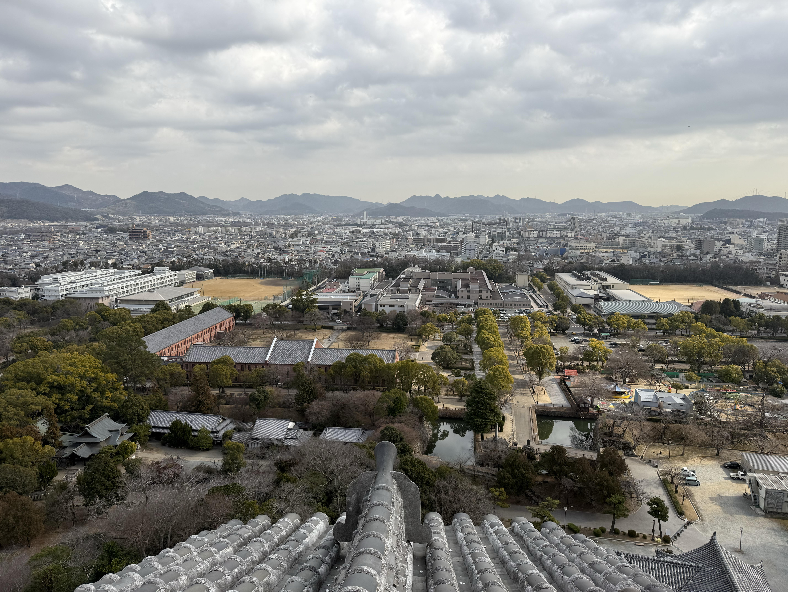

晚餐吃了豬排。醬料是濃稠偏甜的那種，就正常的豬排醬？配上高麗菜絲還不錯。

## 1/20

大阪城跟姬路城比起來，天守閣裡面的博物館感比較重，每層都有展示品介紹歷史，但說實話有點走馬看花。城外的公園反而讓人舒服一些，適合走走。

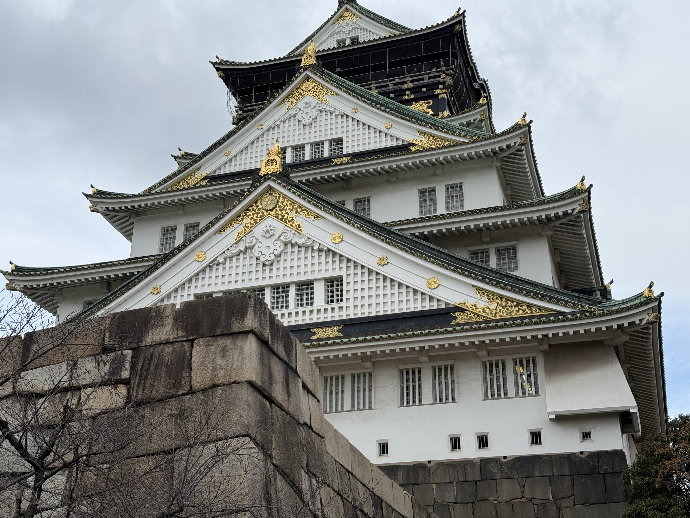

道頓掘晚上的招牌都亮著，人類很多。在這裡感受到大阪的那種熱鬧。吃了點東西，走了很久。

## 1/21

環球影城出乎意料地好玩。本來以為就是個遊樂園，進去之後裡面的景觀還是超出我的想像。哈利波特的區域佈置得很完整，喝到的奶油啤酒是甜的，跟想像差不多，不過我們沒有人買 5000 元的魔杖。

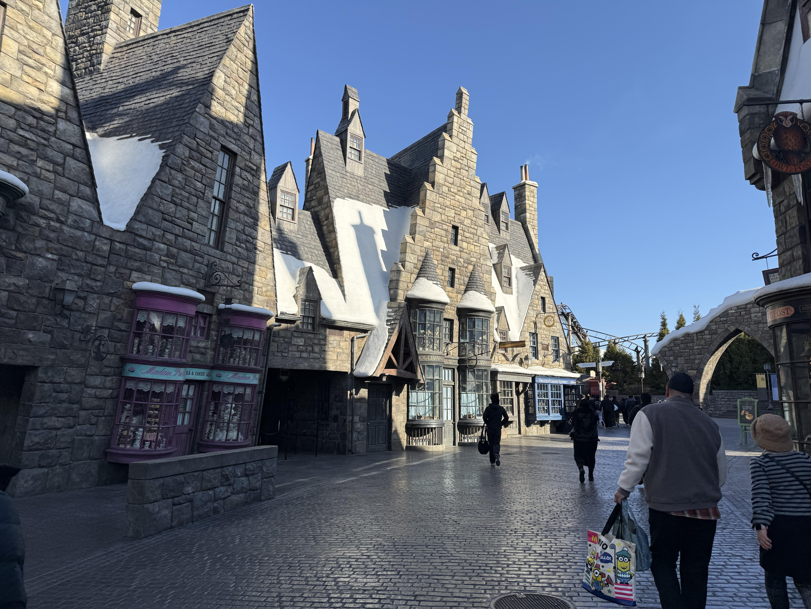

排隊是不可避免的，幾乎每個項目都要等個一小時以上，但整體體驗還是不錯。

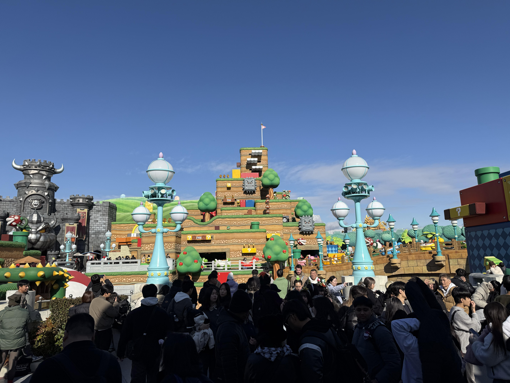

這裡倒是沒有排隊，可能是因為他的容量不小，可以看到小短劇。很有趣的是角色的聲音其實還算相似。

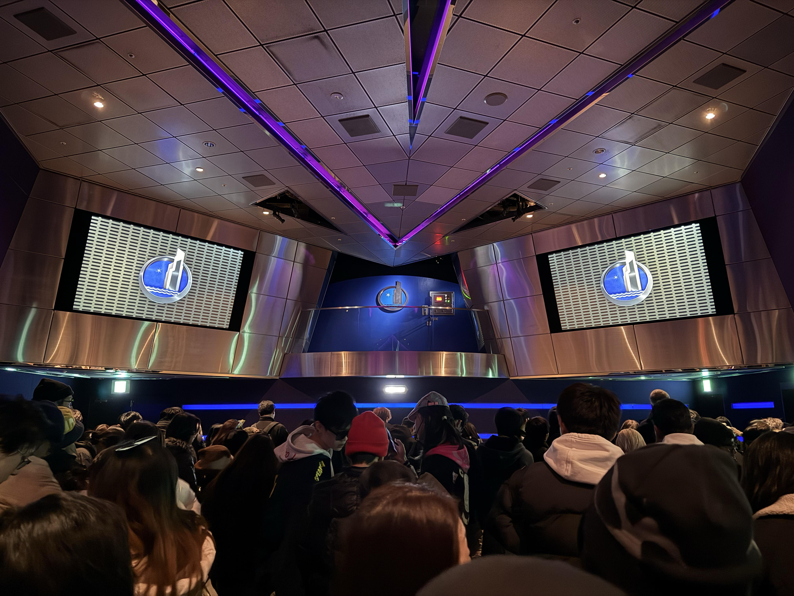

晚上的街景也是，相當有帶入感。

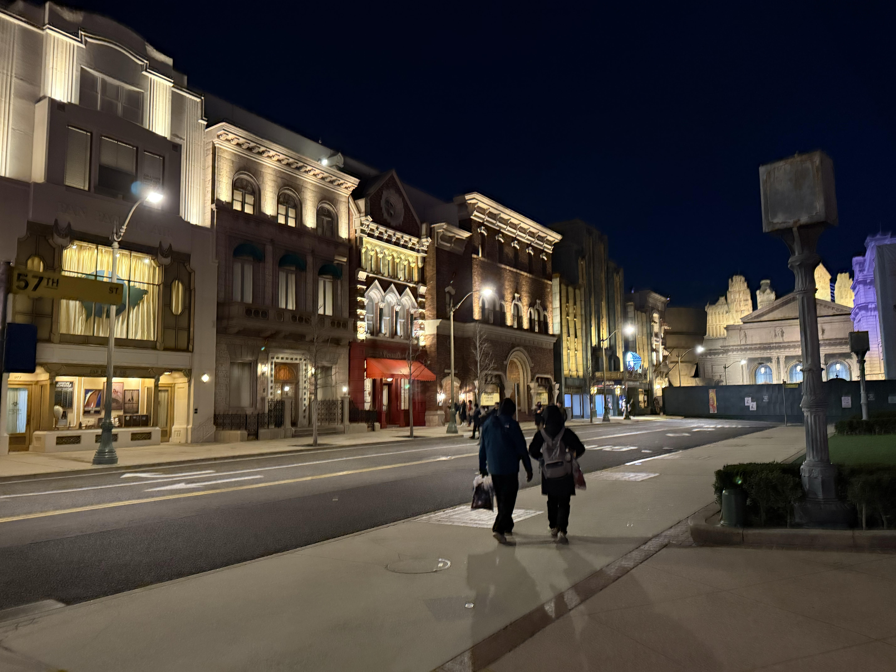

晚餐算是分開吃，只有其中一位跟我一起，我們去居酒屋。裡面的家常小菜 5 件組其實意外的特別好吃，雖然我大多都沒有看過，但是他的調味值得一個特級。

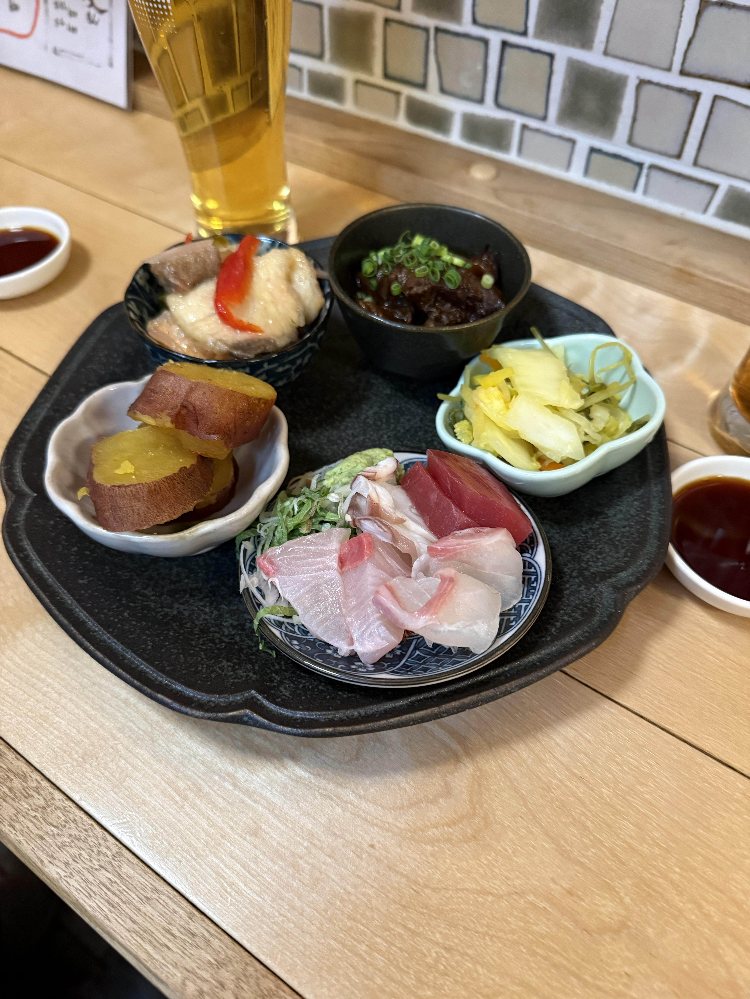

## 1/22

最後一天的任務就是趕飛機。出發的時間比預期緊，一路上都在趕。

機場的食物價格貴也就算了，但是主要還是走到另一邊才發現有比較好的選擇，小虧。

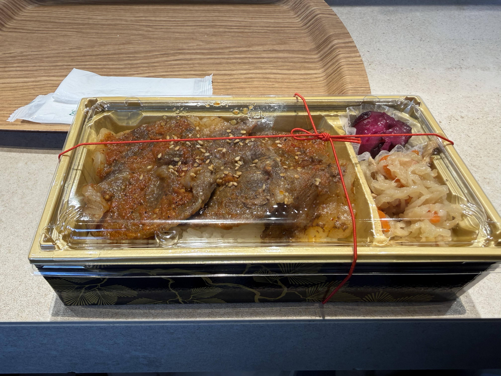

## 其他

感覺日本的臺灣人密度有點高，走在路上常常都可以聽到中文。不過比較在預期之外的是法國人的密度也不小。經常可以聽到法文。
